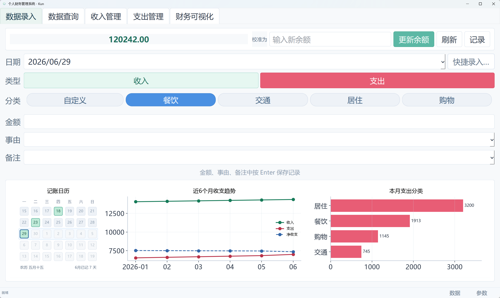
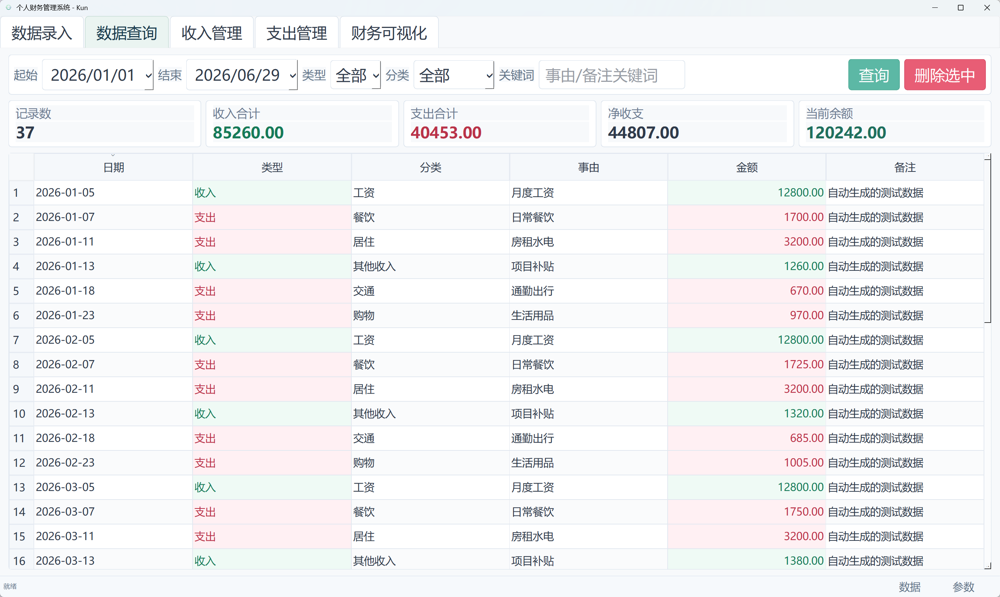
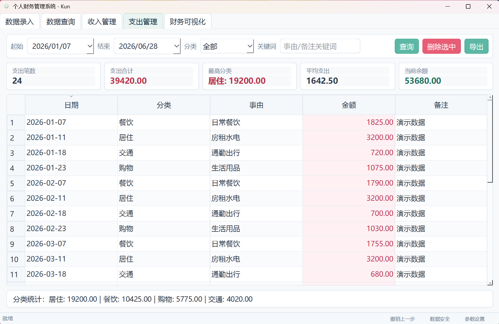
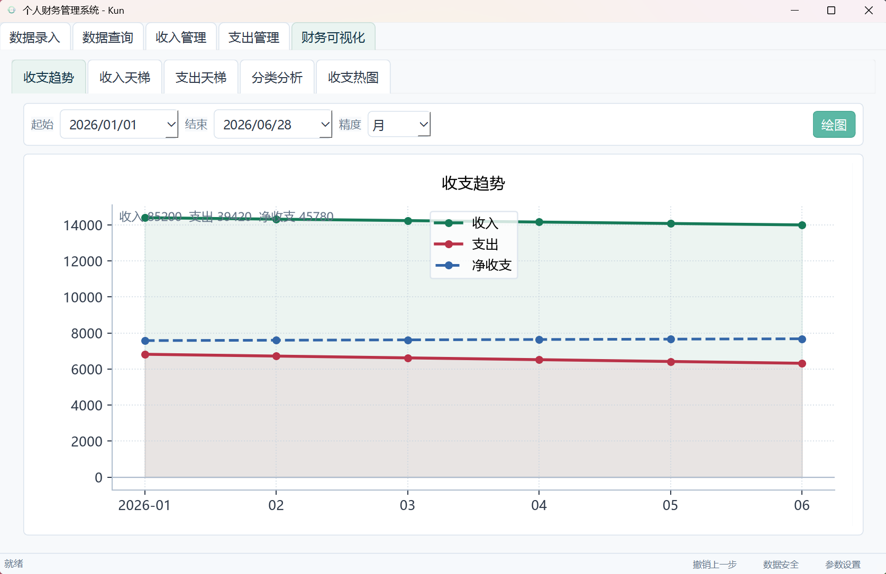
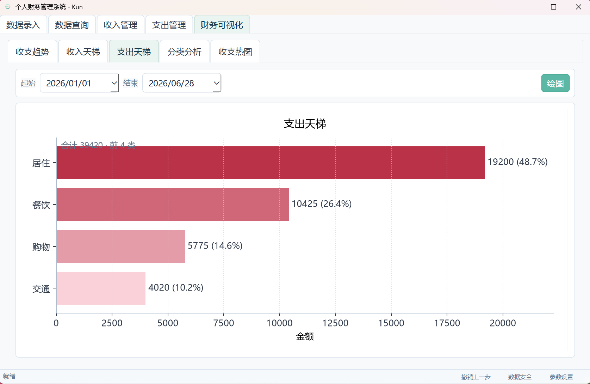
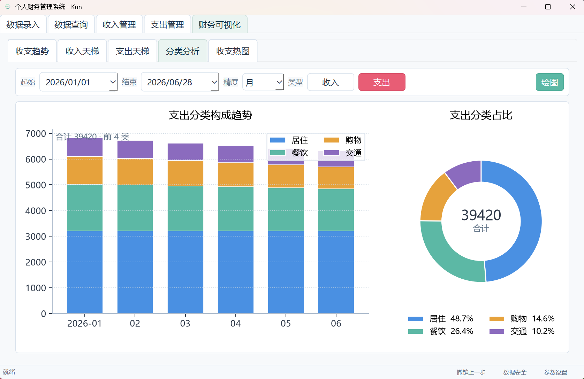
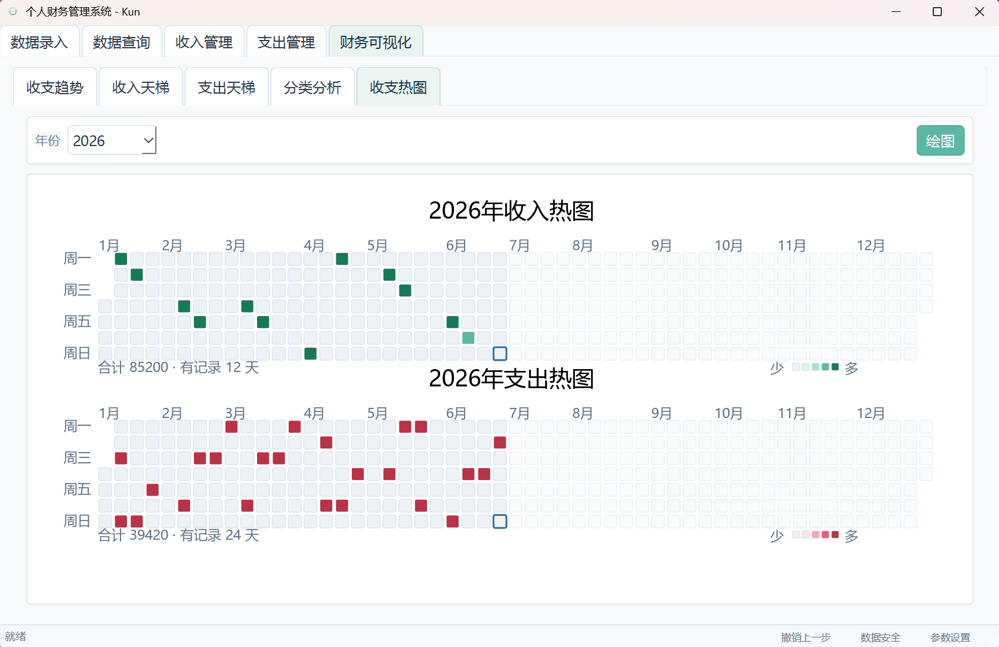

# Finance

Finance 是一个面向个人日常记账和财务回顾的 Windows 免安装程序。它将收入、支出和余额记录保存在本地 Excel 文件中，同时提供查询、管理、统计图表和数据备份功能。

## 界面预览

> 截图中的金额、分类和日期均为演示数据。

## 主要功能

- **数据录入**：快速记录收入和支出，支持分类、事由和备注。
- **余额管理**：查看、校准和回顾每日余额。
- **数据查询**：集中查看收支记录，便于筛选和检查。
- **收支管理**：分别管理收入和支出数据。可直接双击表格单元格编辑日期、分类、事由、金额和备注，完成编辑后自动写回 Excel；同时支持删除和导出。
- **财务可视化**：提供记账日历、月度收支趋势、净收支和支出分类等图表。
- **数据安全**：支持自动备份、备份恢复和撤销上一步操作。
- **本地存储**：财务数据保存在用户指定的 Excel 文件中，不上传到云端。
- **更新检查**：启动后静默检查 GitHub 新版本；无网络或访问失败时不影响使用。

## 功能截图

### 数据查询

可按日期、类型、分类和关键词查询收支记录，并查看合计、净收支和当前余额。

### 支出管理

表格不只用于查看：**双击任意可编辑单元格，即可直接修改记录并写回 Excel**。收入管理页面的操作方式相同。

### 财务可视化

| 收支趋势 | 支出天梯 |
| --- | --- |
|  |  |

| 分类分析 | 收支热图 |
| --- | --- |
|  |  |

## 下载与使用

1. 进入 [Finance 最新版发布页](https://github.com/OAKun/Finance/releases/tag/latest)。
2. 下载 `Finance.exe`。
3. 将程序放在桌面、用户文档或其他具有写入权限的普通文件夹中。
4. 双击运行。首次启动会在程序目录自动生成 `user.config`。

适用于 Windows 64 位环境，无需安装 Python 或其他运行库。

## 数据与配置

- 默认数据文件名为 `finance_records.xlsx`。
- 可在“参数设置”中修改数据目录、Excel 文件名、备份数量和界面字号。
- 可在“参数设置”中开启或关闭启动更新检查；无论自动检查是否开启，都可点击“立即检查”手动查询。
- 更换新版 `Finance.exe` 时，请保留原有 `user.config` 和数据文件。
- 不建议将程序放在可能需要管理员权限的 `Program Files` 目录。

## 本次更新

- 新增 GitHub 静默检查更新。
- 参数设置新增自动更新检查开关和“立即检查”功能。
- 无网络、超时或 GitHub 访问失败时不影响程序启动。
- 更新文件改为固定的 GitHub Release 发布流程。
- 优化打包内容，在不影响功能的前提下减小程序体积。

> 发布新程序前，请同步修改“本次更新”内容。
