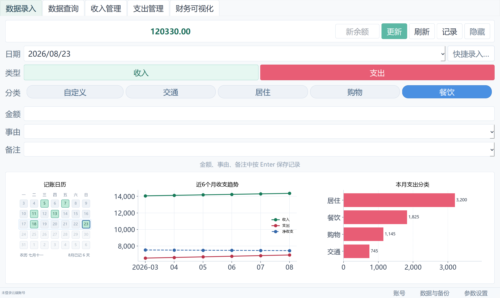
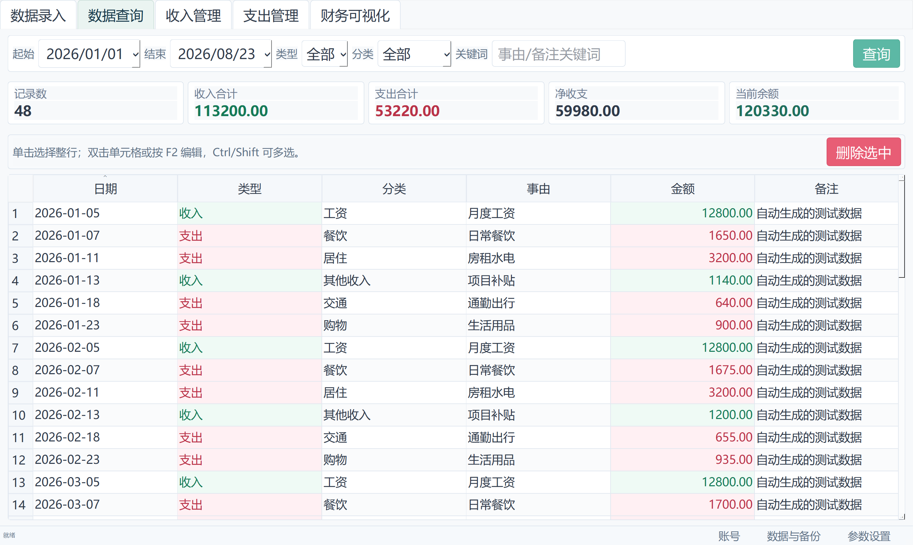
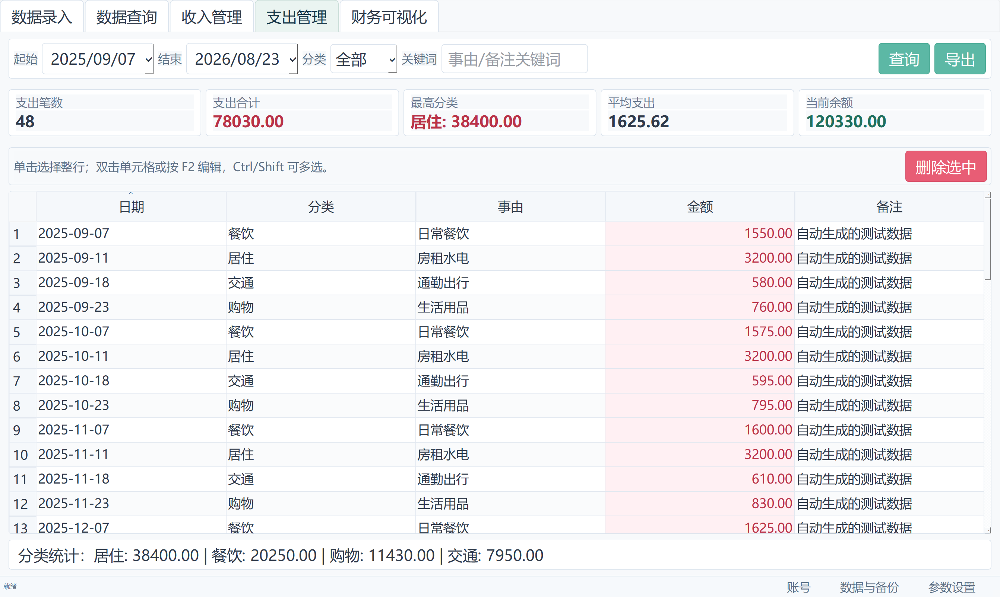
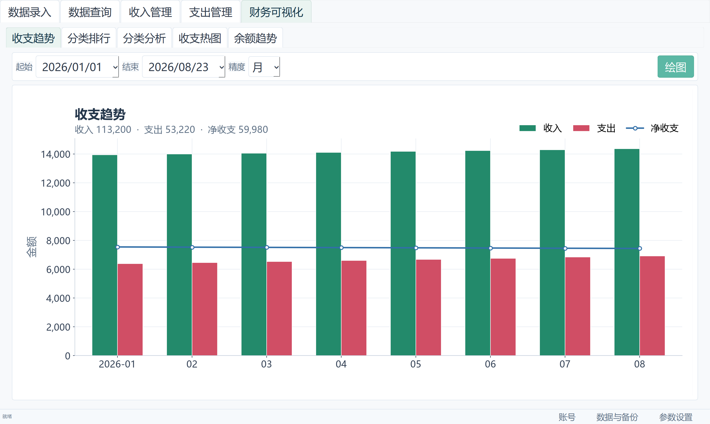
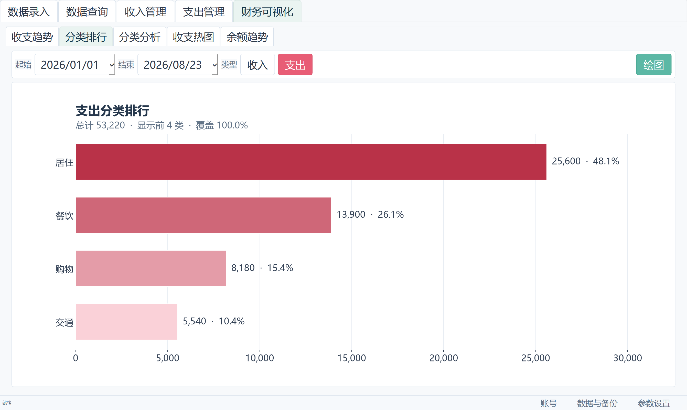
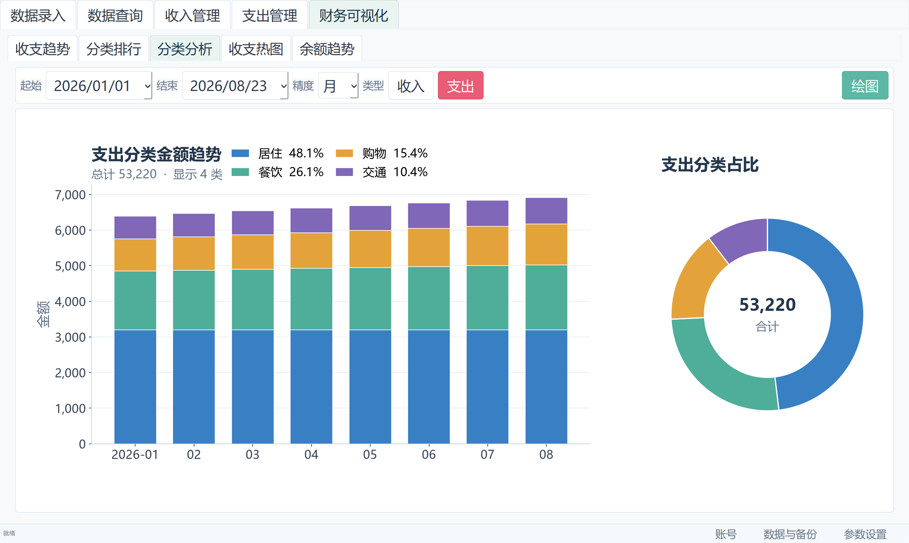
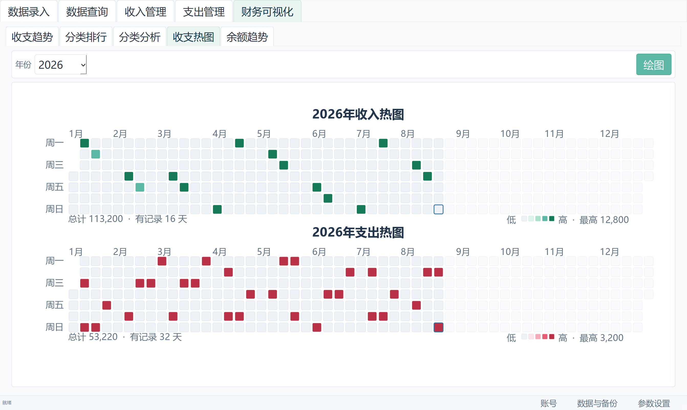
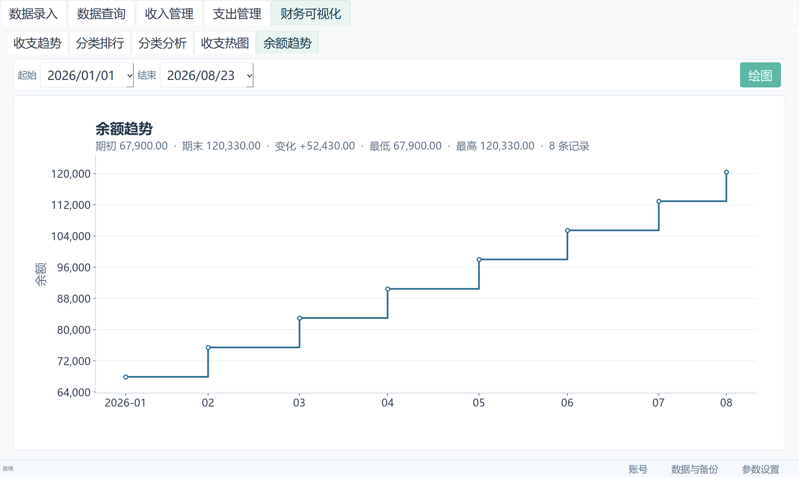

# Finance

Finance 是一个面向个人日常记账和财务回顾的 Windows 免安装程序。

将收入、支出和余额记录保存在本地 Excel 文件中，同时提供查询、管理、统计图表和数据备份功能。

## 界面预览

> 截图中的金额、分类和日期均为演示数据。

## 主要功能

- **数据录入**：支持单条录入和快捷批量录入；批量模式可用空格或中英文逗号分隔参数、换行或中英文分号分隔记录，并可用“分类：”前缀为每条记录指定分类。
- **余额管理**：查看、校准和回顾每日余额。
- **数据查询**：集中查看收支记录，便于筛选和检查。
- **收支管理**：分别管理收入和支出数据。可直接双击表格单元格编辑日期、分类、事由、金额和备注，完成编辑后自动写回 Excel；同时支持删除和导出。
- **财务可视化**：提供记账日历、收支趋势、分类排行、分类分析、年度收支热图和余额趋势。
- **数据管理**：历史备份随数据文件保存并按数量轮换；还可在另一目录维护一个最新副本，支持迁移、手动备份和恢复。
- **本地存储**：程序只读写用户指定的 Excel 文件，不主动上传财务数据；若选择 OneDrive 等同步目录，则由相应同步软件处理。
- **软件更新**：按设置的频率核对 GitHub 最新发布文件；可在程序内下载、查看进度、取消，并经 SHA-256 校验后自动替换和重启。无网络或更新失败时继续使用旧版。

## 功能截图

### 数据查询

可按日期、类型、分类和关键词查询收支记录，并查看合计、净收支和当前余额。

### 支出管理

表格不只用于查看：**双击任意可编辑单元格，即可直接修改记录并写回 Excel**。收入管理页面的操作方式相同。

### 财务可视化

| 收支趋势 | 分类排行 |
| --- | --- |
|  |  |

| 分类分析 | 收支热图 |
| --- | --- |
|  |  |

**余额趋势**

## 下载与使用

1. 进入 [Finance 最新版发布页](https://github.com/OAKun/Finance/releases/latest)。
2. 下载 `Finance.exe`。
3. 将程序放在桌面、用户文档或其他具有写入权限的普通文件夹中。
4. 双击运行。首次启动会在程序目录自动生成 `user.config`，并打开“数据与备份”窗口供用户设置数据文件位置。

适用于 Windows 64 位环境，无需安装 Python 或其他运行库。

首次通过浏览器下载时，如果 Edge 或 Windows 提示“Microsoft Defender SmartScreen 无法验证此文件是否安全”，通常是因为本软件未进行代码签名且下载量较少。程序内自动更新不经过浏览器，但 Windows Defender 仍可能扫描下载或启动的 EXE；遇到拦截时 Finance 会放弃更新并保留或恢复旧版。

每次更新的具体内容请查看 [Finance Releases](https://github.com/OAKun/Finance/releases)。

## 数据与配置

- 默认数据文件名为 `finance_records.xlsx`。
- “数据与备份”可修改数据位置、迁移数据、设置历史备份数量，并按需启用额外最新副本。
- “参数设置”可修改界面字号、自动更新检查频率，也可手动检查更新。
- 历史备份始终位于当前数据目录；额外目录只保留一个最新副本，关闭后不会删除已有文件。
- 自动更新只替换 `Finance.exe`；手动更换新版时也请保留原有 `user.config` 和数据文件。
- 不建议将程序放在可能需要管理员权限的 `Program Files` 目录。
